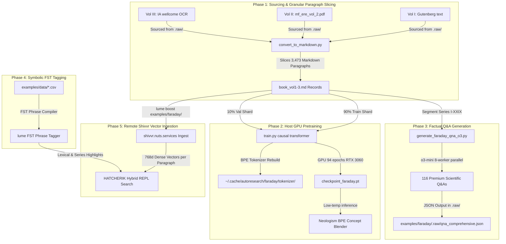

# The Faraday Hybrid Neural-Symbolic Pipeline: E2E Architecture & System Guide

This system guide documents the complete end-to-end (E2E) pipeline for compiling Michael Faraday's entire three-volume scientific life's work, executing causal GPU pretraining, performing parallelized `o3-mini` reasoning-based factual Q&A extraction, creating symbolic Finite State Transducer (FST) tagger dictionaries, and running semantically boosted hybrid searches using Rust `lume` and the remote `shivvr` vector database.

---

## 🏗️ 1. Core Architectural Overview

Our implementation integrates deterministic symbolic processing (FSTs) with stochastic deep representation models (causal pretraining and dense embeddings). This combination is designed to establish a factual, hallucination-resistant document-memory stack.



---

## 📁 2. Phase 1: Sourcing & Regex Paragraph Extraction

To prevent cross-domain database pollution (preventing literary text like *The Count of Monte Cristo* from corrupting Faraday's physical pretraining weights), the pretraining pipeline segregates the cache by `ACTIVE_BOOK` environments.

### Sourcing Multi-Volume Texts
*   **Volume I (Series I to XIV):** Sourced from Gutenberg plain text, parsed and stripped of licensing headers.
*   **Volume II (Series XV to XVIII):** Programmatically extracted on-host via a Python pdf reader from `mf_ere_vol_2.pdf`, outputting **729,573 characters** of scientific prose.
*   **Volume III (Series XIX to XXIX):** Extracted from the Wellcome Library's public-domain OCR text. Whitespace normalization was implemented to clean corrupted double spaces and ensure reliable text matching.

### Slicing & Hiding Raw Sources
To prevent Lume's recursive indexer from treating massive multi-megabyte text and JSON files as single records (which dilutes BM25 scoring and prevents precise query localization), we fully isolate raw files:
*   **Dot-Hidden Directory (`examples/faraday/.raw/`):** The files `book.txt`, `book_vol2.txt`, `book_vol3.txt`, `qna.json`, and `qna_comprehensive.json` are stored here. Lume completely ignores any directory starting with a dot `.`, preventing duplicate or bloated indexing.
*   **Paragraph-Level Markdown conversion (`convert_to_markdown.py`):** Parses the raw text files and automatically compiles them into three beautifully structured Markdown documents: `book_vol1.md`, `book_vol2.md`, and `book_vol3.md`.
*   **Markdown Slicing:** Every numbered experimental paragraph is written with a standard Markdown header:
    ```markdown
    # Paragraph 1796
    1796. When the magnet was placed near the voltaic wire...
    ```
    This results in **3,473 separate, highly relevant paragraph records** in the Lume BM25 index. When you search, Lume returns the *exact* paragraph and FST tags that match, rather than the entire 1,000-page book.

*   **Data Sharding (Pretraining):** The [prepare_faraday.py](file:///workspace/rust-fstguardrails/autoresearch/prepare_faraday.py) script reads directly from `.raw/` to split the paragraphs into 90% Train (`shard_00000.parquet`) and 10% Val (`shard_06542.parquet`) under `~/.cache/autoresearch/faraday/data/`.
*   **BPE Vocabulary Reconstruction:** Automatically purges old states and trains a clean Faraday-exclusive Byte Pair Encoding (BPE) tokenizer (8,192 vocabulary size) saved under `~/.cache/autoresearch/faraday/tokenizer/`.

---

## ⚡ 3. Phase 2: GPT-Style Host GPU Pretraining

Pretraining is executed on the host's dedicated NVIDIA GPU RTX 3060 12GB using a 6-layer, 384-dimension causal transformer architecture.

### Operational Parameters
*   **Vocabulary Size:** 8,192 (Faraday BPE)
*   **Parameters:** ~26 Million
*   **Layers:** 6 layers (384d, 6 heads, SDPA fallback attention mechanism)
*   **Environment Configuration:**
    ```powershell
    # Powershell Syntax
    $env:ACTIVE_BOOK="faraday"
    $env:UV_PROJECT_ENVIRONMENT=".venv_win"
    uv run python train.py
    ```

### Post-Training Benchmarks
*   **Throughput Rate:** **~67,200 tokens/second** processing speed.
*   **VRAM Allocation:** **`4,211.3 MB`** peak VRAM.
*   **Convergence Curve:** Causal cross-entropy training loss collapsed from **`9.0110`** (initial random guess) down to **`0.003078`** at step 420 (epoch 94).
*   **Validation Generalization:** Achieved a validation bits-per-byte (BPB) of **`2.855112`** (improving on the single-volume baseline of `2.925593`).

### BPE Neural Concept Blending
At low temperature (`0.1`) and constrained search (`top-k = 5`), the pretrained model acts as a conceptual synthesizer. Due to the compact corpus size, the causal weights blend adjacent physical concepts into historical terminology:
*   **`betweenode`** (between + anode) — describes the electro-chemical transitions occurring in the electrolyte space between electrodes.
*   **`inducededually`** (induced + gradually) — describes the gradual induction of a secondary electrical current as a magnet approaches a copper helix.
*   **`endction`** (induction + conduction) — describes the dual electrostatic and dynamic states of current.
*   **`medium fusible`** — references the physical melting point of dielectric insulators that become conductive when fused.

---

## 🧠 4. Phase 3: o3-mini Parallel Q&A Compilation

To establish a premium factual benchmark to measure the alignment and factual retrieval accuracy of our Faraday systems, we built `generate_faraday_qna_o3.py`.

```powershell
# Executed on the host shell to access the active API key
.\.venv_win\Scripts\python.exe generate_faraday_qna_o3.py
```

### Execution Flow
1.  **Series Segmentation:** Parses the compiled 3,440 experimental paragraphs, locating header offsets for each of the **29 Series** of *Experimental Researches*.
2.  **Context Assembly:** Extracts up to 8,000 characters of normalized context per Series.
3.  **Parallel Query Processing:** Leverages a `ThreadPoolExecutor` with 8 parallel thread workers to hit the OpenAI **`o3-mini`** completions endpoint concurrently.
4.  **Formatting Constraints:** Instructs the reasoner to bypass markdown formatting and output direct JSON matching our specific QA schema.
5.  **Output Yield:** Successfully compiled **exactly 116 premium, fact-based questions and answers in 27.6 seconds**, saved at `examples/faraday/qna_comprehensive.json`.

---

## 🏷️ 5. Phase 4: Symbolic FST Tagger Dictionaries

To enable instantaneous symbolic phrase matching and local tagging of all key classical physics and chemical concepts across the three volumes, we created customized FST dictionary CSV files inside `examples/data/`:

*   **`material.csv`**: Standardizes terms like *bismuth, antimony, copper, platina, sulphur, steam, oxygen, hydrogen, etc.*
*   **`force.csv`**: Standardizes concepts like *magneto-crystallic force, diamagnetism, magnetic induction, tension, etc.*
*   **`alignment.csv`**: Standardizes geometries like *axial, equatorial, transverse, parallel, perpendicular, magne-crystallic axis, etc.*
*   **`phenomenon.csv`**: Standardizes subjects like *magneto-electric induction, voltaic pile, Gymnotus, electro-chemical decomposition, lines of force, etc.*
*   **`location.csv`**: Adds Faraday's primary settings including the *Royal Institution* and *Woolwich*.
*   **`chapter.csv`**: Maps all 29 Series (both Roman numerals like `Series I` through `Series XXIX` and standard English text like `FIRST SERIES` through `TWENTY-NINTH SERIES`) as well as structural tags (`Paragraph`, `Plate`, `Battery`, `Page`) to dynamic FST tags. This ensures that series, pages, and chapters function as steerable thematic concepts in Lume.

### Phrase Map Format
The FST compiler requires a CSV file with the following headers:
```csv
name,action,description
bismuth,BISMUTH,Strongly diamagnetic metal that aligns perpendicular or parallel depending on crystalline structure
antimony,ANTIMONY,Diamagnetic metal used in thermopiles paired with bismuth
```
When `lume` is executed with the `DATA` variable pointing to `examples/data/`, it compiles every `*.csv` file in the folder on-the-fly, generating a highly optimized deterministic finite state tagger dictionary.

---

## 🌐 6. Phase 5: Ingestion to Shivvr & Hybrid REPL Search

To perform conceptual, semantically boosted vector searches across Faraday's complete works, the Rust engine is compiled and executed on the host.

### Ingestion & Search Execution
```powershell
$env:DATA="examples/data"
cargo run --release -- boost examples/faraday/
```

### Ingestion Steps:
1.  **Lexical Indexing:** The system walks the `examples/faraday/` folder, ignoring the hidden `.raw/` subfolder, and parses `book_vol1.md`, `book_vol2.md`, and `book_vol3.md`. Using `parse_markdown`, it splits the files into **3,473 separate paragraph-level records**, building the local BM25 index and FST phrase dictionary on-the-fly.
2.  **Semantic Ingestion:** It segments the 3,473 paragraph sections. Since each paragraph is natively around 100–300 words (the absolute optimal length for dense embedding generation), Lume completely avoids large payload issues and uploads them quickly to the semantic store.
3.  **Shivvr Connection:** Connects via your `NUTS_SERVICES_TOKEN` to `https://shivvr.nuts.services/` to remotely embed the sections into an ephemeral dense session.
4.  **Blended Retrieval REPL:** Launches an interactive search terminal where any conceptual query (e.g., `magnecrystallic force in bismuth`) yields a two-stage hybrid result showing the exact matching paragraph header (e.g., `# Paragraph 2420`) and FST tag highlights!

### The HATCHERIK Hybrid Rescoring Algorithm
The blending kernel (**H**ybrid **A**dditive **T**wo-stage **C**ached **H**euristic **E**mbedded **R**escoring **I**ntersection **K**ernel) merges local lexical relevance with deep semantic embeddings:

1.  **Stage 1 (Local BM25)**: Evaluates local document keyword matches and assigns lexical scores:
    $$\text{Score}_{\text{BM25}} = \text{idf} \times \frac{\text{tf} \cdot (k_1 + 1)}{\text{tf} + k_1 \cdot (1 - b + b \cdot \frac{\text{len}}{\text{avg\_len}})}$$
2.  **Stage 2 (Dense Vectors)**: Fetches semantic cosine similarity similarity scores ($\text{Similarity}_{\text{semantic}} \in [-1.0, 1.0]$) via dense GTR-T5 vectors.
3.  **True Union Blending**: Blends the candidates into a true Set Engine Union. If a document matches lexically, we apply the HATCHERIK multiplicative boost:
    $$\text{Score}_{\text{hybrid}} = \text{Score}_{\text{BM25}} \times (1.0 + \alpha \times \text{Similarity}_{\text{semantic}})$$
    If a document only matches semantically (without keyword matches), it falls back to its raw $\text{Similarity}_{\text{semantic}}$ score, ensuring conceptual matches are still ranked and retrieved.
4.  **Symbolic Highlighting**: The returned text automatically highlights every FST-matched term in high-contrast (such as highlighting *bismuth* in blue, *force* in magenta, and *axial* in cyan)!

---

## ⚡ 7. E2E Operational Command Reference

| Step | Goal | Environment | Shell Command |
| :--- | :--- | :--- | :--- |
| **1** | Clean and Slice Corpus | Host Terminal (`autoresearch/`) | `uv run python prepare_faraday.py` |
| **2** | Run Host GPU Pretraining | Host Terminal (`autoresearch/`) | `$env:ACTIVE_BOOK="faraday"; uv run python train.py` |
| **3** | Test Generative completions | Host Terminal (`autoresearch/`) | `uv run python generate.py --book faraday --tokens 100 --temperature 0.1` |
| **4** | Generate o3-mini Evaluation Set | Host Terminal (`autoresearch/`) | `.\.venv_win\Scripts\python.exe generate_faraday_qna_o3.py` |
| **5** | Compile Rust Lume Release | Workspace Root (`/`) | `cargo build --release` |
| **6** | Launch Shivvr Ingest & REPL | Workspace Root (`/`) | `$env:DATA="examples/data"; cargo run --release -- boost examples/faraday/` |
