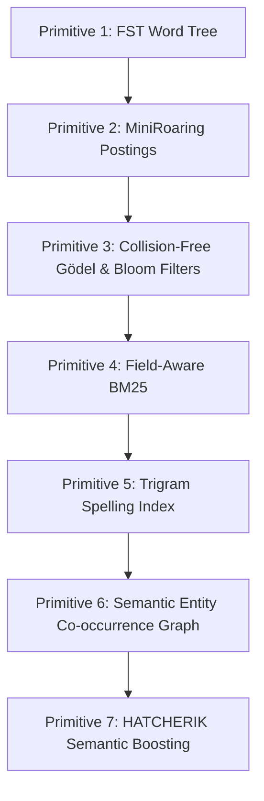

# Lume: Memory for Your Documents

A small Rust search engine for document memory: FST phrase tagging, on-demand indexing, bitmap retrieval, BM25 ranking, spelling correction, entity graphs, and optional semantic boosting.

Crawling is back. Agents need fresh pages, local files, manuals, specs, and logs.

But once you crawl it, where do you put it?

Lume is the answer: a fast, local document-memory engine built from simple search primitives.

<div align="center">

[](rust_setup.md)
[](https://github.com/jsclosures)
[](https://github.com/kordless)

</div>

## What Lume Does

- **Crawl on demand** — point it at a file or directory and search immediately.
- **Tag exact phrases fast** — FST-backed entity and phrase matching.
- **Retrieve with real search math** — MiniRoaring postings, BM25, BM25+, and BM25-L.
- **Handle messy queries** — trigram spelling correction and fuzzy guardrails.
- **Find relationships** — entity co-occurrence graphs using Jaccard overlap.
- **Blend semantics carefully** — optional HATCHERIK lexical + vector boosting.

## Why It Exists

LLMs need memory, but not all memory is chat history.

Documents are memory too: crawled pages, manuals, books, logs, markdown files, specs, support tickets, and source-adjacent notes. Lume is a small, inspectable search stack for that memory.

FSTs find the known things.  
BM25 ranks the text.  
Bitmaps isolate candidates.  
Semantic boosting adds intent without replacing lexical truth.

Then the machine remembers where it saw the thing.

---

## ⚡ Quick Start Guide

Get Lume up and running in under two minutes.

### 1. Build and Test the System
Ensure you have the Rust toolchain installed (see the comprehensive [rust_setup.md](rust_setup.md) for local environment configuration), then clone and compile:
```bash
# Clone the repository
git clone https://github.com/kordless/lume.git
cd lume

# Run the test suite (MiniRoaring bitsets, FST match matrices, and spelling correctors)
cargo test

# Build fully optimized production release binaries
cargo build --release
```

### 2. Prepare a Gutenberg Test Corpus
To fetch and format *The Count of Monte Cristo* (~2.66 MB) as an on-demand test corpus:
```bash
mkdir -p examples
curl -L -s https://www.gutenberg.org/files/11/11-0.txt > examples/monte_cristo.txt

# Convert Gutenberg chapter titles into markdown headers for the parser
sed -E 's/^(CHAPTER [0-9]+)\. (.*)$/# \1. \2/' examples/monte_cristo.txt > examples/monte_cristo.md
```

### 3. Run Your First Search
Lume crawls, tokenizes, indexes, and queries the corpus in milliseconds:
```bash
# Crawl and search the entire examples/ directory on-the-fly
DATA="examples/data" cargo run --release --bin search -- examples "monte cristo"
```

### 4. Connect to AI Agents and IDEs via Model Context Protocol (MCP)
Lume features a native, zero-dependency JSON-RPC 2.0 stdio server, exposing offline tagging, hybrid search, and steered Markov generation tools directly to clients like Cursor or Claude Desktop:
```bash
# Start the native stdio MCP server locally
DATA="examples/data" cargo run --release --bin lume -- mcp
```

### 5. Try the HATCHERIK Semantic Boosting REPL
Coordinate with a remote neural embedder ([shivvr.nuts.services](https://shivvr.nuts.services/)) to run conceptual searches:
```bash
DATA="examples/data" ALPHA=2.0 cargo run --release --bin hatcher-boost -- examples/monte_cristo.md
```

---

## 🛠️ The Seven Primitives of Lume

Lume is designed as a stack of modular, self-contained search primitives. Each layer builds upon the FST word tree to add query understanding, search relevance, spatial graphs, and semantic intent.



### [Primitive 1] The FST Phrase Tagger
The foundation of the engine is the Finite State Transducer. It parses dictionaries of phrases (loaded dynamically from CSV files in the `DATA` directory) and compiles them into a single FST byte map.
*   **What it does**: Scans incoming text streams and tags entities in $O(\text{text length})$ time, matching synonyms and resolving overlapping spans using a longest-match policy.
*   **OG Code Reference**:
    ```rust
    // Compiles search phrases into deterministic state paths in src/lib.rs
    let mut builder = MapBuilder::memory();
    for (key, idx) in &keyed {
        builder.insert(key, *idx)?;
    }
    ```

### [Primitive 2] MiniRoaring Bitmaps
To support lightning-fast document isolation, we represent the posting lists of the search index using roaring bitmaps.
*   **What it does**: Instead of tracking document lists with basic integer arrays or maps, Lume maps terms to custom-built `MiniRoaring` bitsets. For multi-word queries, it performs intersection (`AND`) or union (`OR`) bitsets in microseconds to immediately restrict candidate documents.
*   **OG Code Reference**:
    ```rust
    // Intersects document hit candidate sets instantly in src/fast_retrieval.rs
    pub fn intersection(&self, other: &Self) -> Self {
        // High-speed bitwise AND operations over packed integer blocks
    }
    ```

### [Primitive 3] Collision-Free Gödel & Bloom Filters (Gödel Pruning)
Lume uses dynamic sequential prime mappings and an ultra-fast CPU-optimized bitwise Bloom filter to prune the candidate document search space at high velocities, yielding extreme performance gains during scoring.
*   **What it does**:
    1.  **Dynamic Sequential Prime Gödel Tagger (Collision-Free)**: Instead of hashing tags into a static array of 100 primes (which yields collisions and false-positive matches), Lume dynamically compiles unique tag keys during corpus ingestion (`Bm25Index::build`) and assigns them unique sequential prime numbers ($2, 3, 5, 7, 11, \dots$). The map `tag_prime_map: HashMap<String, u128>` guarantees that every unique tag represents a distinct prime number, completely avoiding any hash collision.
    2.  **Deterministic Division Bypass**: For each document, its FST tags are multiplied into a perfect Gödel signature (`tag_signature: u128`). During search, if a query filters by a specific tag, Lume performs an exact divisibility check:
        ```rust
        tag_signature.is_multiple_of(query_tag_prime)
        ```
        If the signature is divisible by the query's prime, it is guaranteed to contain the tag. If it is not divisible, it is pruned immediately in under **30 nanoseconds**, bypassing expensive scoring entirely.
    3.  **Graceful Saturation Fallback**: To prevent arithmetic overflow of the `u128` signature product, the signature safely saturates to `0` once a document accumulates more than ~15-20 distinct tags. Under modular arithmetic, `0` is divisible by any prime, so the check gracefully falls back to normal evaluation without losing any valid matches.
    4.  **64-bit Bitwise Bloom Filter (`term_mask` / Prime-Modulo Bypass)**: The old multi-lane modulo signature check for lexical terms (`signatures[bucket] % termPrime == 0`) forced the CPU to perform costly division operations (taking tens of clock cycles) on the critical scoring loop. We replaced this with a sleek, CPU-friendly **64-bit bitwise Bloom filter** (`term_mask: u64`) using double FNV-1a hashing. Lexical checking is now a single-cycle bitwise operation:
        ```rust
        (term_mask & query_term_mask) == query_term_mask
        ```
        This completely eliminates division operations from the critical pruning path.
*   **OG Code Reference**:
    ```rust
    // Sleek, high-speed 64-bit bitwise Bloom filter and Gödel signature checks in src/fast_retrieval.rs
    pub struct PrimeFilter {
        pub term_mask: u64,
        pub tag_signature: u128,
    }
    
    impl PrimeFilter {
        pub fn test_term(&self, term_bytes: &[u8]) -> bool {
            let h = fnv1a_hash(term_bytes);
            let idx1 = h & 0x3F;
            let idx2 = (h >> 16) & 0x3F;
            let mask = (1u64 << idx1) | (1u64 << idx2);
            (self.term_mask & mask) == mask
        }
        
        pub fn test_tag_prime(&self, prime: u128) -> bool {
            self.tag_signature == 0 || self.tag_signature.is_multiple_of(prime)
        }
    }
    ```

### [Primitive 4] Field-Aware BM25 Scoring
The lexical scoring core implements BM25 ranking, allowing fields (like document titles vs. document bodies) to carry different weights.
*   **What it does**: Evaluates matches and assigns relevance scores based on three configurable formulations: Classic, BM25+, and BM25-L (optimized for varying document lengths).
*   **OG Code Reference**:
    ```rust
    // Scoring logic configured dynamically via environment parameters:
    let bm25_score = idf * (tf * (k1 + 1.0)) / (tf + k1 * (1.0 - b + b * (doc_len / avg_len)));
    ```

### [Primitive 5] Trigram Spelling Index
A dedicated spelling corrector built directly into the indexing phase.
*   **What it does**: Breaks down both the static FST tagger phrases and the corpus terms into character-level trigrams (e.g., `"this"` $\rightarrow$ `["_th", "thi", "his", "is_"]`). It builds an inverted index of these trigrams using roaring bitmaps and BM25.
*   **Fuzzy Guardrails**: If a user misspells an FST tag (including naughty/offensive words), Lume's spelling index automatically maps it back to the closest matching dictionary term using Levenshtein edit-distance checks before querying.
*   **OG Code Reference**:
    ```rust
    // Resolves typos like "lucne" to "lucene" in src/spelling.rs
    let suggestions = spell_index.correct_word("lucne", 1); // Returns "lucene"
    ```

### [Primitive 6] Semantic Entity Co-occurrence Graph (Option A)
A mathematical graphing layer crossing FST dictionary tags with document roaring bitmaps, inspired by **Trey Grainger's** Semantic Knowledge Graph (SKG) design.
*   **What it does**: Computes the exact co-occurrence frequency and Jaccard similarity between all registered entities based on their document overlap:
    ```text
    Jaccard(A, B) = |A ∩ B| / |A ∪ B|
    ```
    Drawing from Trey's original work on Solr's **Semantic Knowledge Graph (SKG)** at **Lucidworks**, this demonstrates how search indices can calculate semantic relationships dynamically. Lume serializes this network into a clean `monte_cristo_graph.json` mesh file in less than **1 millisecond** using a custom zero-dependency JSON writer, displaying a beautiful box-aligned relationship grid in the console:
    ```text
    ┌──────────────────────────────┬──────────────────────────────┬────────┬───────┐
    │ ENTITY A                     │ ENTITY B                     │JACCARD │CO-OCC │
    ├──────────────────────────────┼──────────────────────────────┼────────┼───────┤
    │ VALENTINE                    │ VILLEFORT                    │ 0.4400 │  33/75  │
    │ DANTES                       │ MARSEILLES                   │ 0.4386 │  25/57  │
    │ ALBERT                       │ MONTECRISTO                  │ 0.4368 │  38/87  │
    │ DANTES                       │ MERCEDES                     │ 0.4348 │  20/46  │
    │ DANGLARS                     │ MONTECRISTO                  │ 0.4272 │  44/103 │
    │ ALBERT                       │ PARIS                        │ 0.4186 │  36/86  │
    │ MONTECRISTO                  │ VILLEFORT                    │ 0.4144 │  46/111 │
    │ MAXIMILIAN                   │ VALENTINE                    │ 0.4043 │  19/47  │
    │ DANGLARS                     │ VILLEFORT                    │ 0.4021 │  39/97  │
    │ MARSEILLES                   │ PARIS                        │ 0.4000 │  36/90  │
    │ DANTES                       │ PHARAON                      │ 0.3750 │  15/40  │
    │ MARSEILLES                   │ VILLEFORT                    │ 0.3721 │  32/86  │
    │ FERNAND                      │ MERCEDES                     │ 0.3714 │  13/35  │
    │ DANTES                       │ FARIA                        │ 0.3684 │  14/38  │
    │ CHATEAUDIF                   │ DANTES                       │ 0.3500 │  14/40  │
    │ MARSEILLES                   │ MERCEDES                     │ 0.3455 │  19/55  │
    │ MERCEDES                     │ PHARAON                      │ 0.3429 │  12/35  │
    │ MAXIMILIAN                   │ NOIRTIER                     │ 0.3400 │  17/50  │
    └──────────────────────────────┴──────────────────────────────┴────────┴───────┘
    ```

### [Primitive 7] HATCHERIK Semantic Boosting & Vector Integration (`hatcher-boost`)
Our flagship hybrid integration, implementing **HATCHERIK** (**H**ybrid **A**dditive **T**wo-stage **C**ached **H**euristic **E**mbedded **R**escoring **I**ntersection **K**ernel) semantic boosting, pioneered by search veteran **Erik Hatcher** (co-founder of **Lucidworks**).
*   **What it does**: Combines the precision and safety of local lexical search with the conceptual awareness of deep-neural ONNX embeddings:
    1.  **Stage 1 (ONNX Semantic Retrieval & Local Cache)**: Searches our local persistent index (`.lume-semantic-cache.json`) to find query results instantly offline (**<1ms**). On a cache miss, it lazily connects to an ephemeral session on [shivvr.nuts.services](https://shivvr.nuts.services/) to fetch semantic similarity scores and automatically preserves the query to the local cache.
    2.  **Stage 2 (Local Lexical Scoring)**: Calculates standard BM25 rankings.
    3.  **True Union Blending**: Blends the candidates into a true Set Engine Union. If a document matches lexically, we apply the HATCHERIK multiplicative boost:
        ```text
        Score_hybrid = Score_BM25 * (1.0 + alpha * Similarity_semantic)
        ```
        If a document only matches semantically (without keyword matches), it falls back to its raw `Similarity_semantic` score, ensuring conceptual matches are still ranked and retrieved.
*   **OG Code Reference**:
    ```rust
    // Core hybrid blend in src/bin/hatcher_boost.rs
    let hybrid_score = if bm25_score > 0.0 {
        bm25_score * (1.0 + alpha * sem_score)
    } else {
        sem_score
    };
    ```

---

## 📖 The Backstory: How it All Connects

Lume is the story of ideas moving from one person to another—a search meme carried through years of crawling systems, open-source heritage, industrial search consulting, and modern AI capability.

### 🐧 The Seed: It Began with Crawling (Grub)
It all started with web crawling. Back in the early days of distributed search, [Kord Campbell](https://www.linkedin.com/in/kordless) created **Grub**—a massively distributed web crawler. After installing Lucene, Kord sent an email to Eric Schmidt (then-CEO of Google), saying: *"Hey, I've got this super fast distributed crawler."* Schmidt replied with a classic search insight: *"That's not the problem. We've got crawling figured out. Indexing is the challenge."*

Decades later, that conversation has come full circle. In the age of AI, **crawling is everything again**. To feed frontier LLMs, you have to crawl to get the content, and you need a crawler that you can control. 

But once you crawl it, where do you put it? 

### 🧠 The Memory Challenge
You can't crawl the web fresh every single time you need an answer. Web pages are a type of document memory. Unlike bot or conversational memory (like an LLM remembering that a user's parrot is blue), document memory is about capturing the precise text you just saw. Some of these pages never update, while others update every minute with stock prices or weather data. You need a dedicated, extremely fast local document store to hold and index this memory.

That's when the pieces fell into place. Kord was watching LinkedIn and saw [Steve Harris](https://www.linkedin.com/in/steveharris0) post about porting his zero-dependency Java FST tagger to Rust (released as [fstguardrails](https://github.com/jsclosures/fstguardrails)). Steve had run [Portaltown](https://www.portaltown.com), a search consultancy, and had worked for **Lucidworks**. His background as a U.S. Marine Corps air traffic controller deeply influenced how he designed systems: a pure focus on safety, extreme precision, and bare-metal performance. 

Kord saw Steve's post and realized: *"That FST tagger is the first part of our document index."*

### 💡 The "Aha" Moments (Erik Hatcher & Trey Grainger)
To turn that FST tagger into a complete, lightweight search engine, Kord drew on years of shared search history. During his time consulting at **Lucidworks**, Kord had met OG search veterans [Trey Grainger](https://www.linkedin.com/in/treygrainger) and [Erik Hatcher](https://www.linkedin.com/in/erikhatcher). 

Trey's work on Solr's **Semantic Knowledge Graph (SKG)** had always stuck with Kord. The concept seemed complex, but Erik Hatcher had delivered the ultimate "aha" moment by putting it simply: 
> *Facets are just counts of the occurrences of something in a document. The Knowledge Graph is simply looking at those counts across all documents to perform document intersections. It is just counting the counts of things.*

That was the magic of Erik Hatcher—he has always had the unique gift of taking complex technology and showing everyone how it actually works under the hood. (We throw affectionate shade at Trey for making it look complicated, and at Eric for making it look too simple!)

Understanding that primitive meant realizing a high-speed search engine didn't need millions of lines of code. It just needed to do simple things incredibly fast: FSTs for words, roaring bitmaps for set intersections, spell correction for misspellings, and additive hybrid boosting for vector context. We wanted a system built with **only one external library** (`tantivy-fst`), and the rest made of pure, clean, understandable ideas.

### 🚀 The 24-Hour AI Genesis
A few months ago, Kord fired up Claude and said, *"Build me a simple BM25 index for these words."* It did, and looking at the clean code made the mathematical simplicity of BM25 click. 

When Steve's Rust FST was released, Kord fired up **Antigravity**—a frontier-level AI coding assistant that Google just dropped days ago. Since Google is the undisputed king of web search, it is beautifully poetic that their own state-of-the-art AI pair-programmer helped write this search engine.

Working in a continuous human-AI feedback loop with Kord's prattling systems-brain guiding the high-level design, Antigravity rapidly wrote and assembled the primitives. In a single 24-hour sprint, Lume went from an FST tagger to a complete, powerful, ultra-small search engine mesh. Kord called Steve, and they decided to put it out there for the world.

---

## 🧠 Concept-Steered Transformer Pretraining Setup (Autoresearch)

Lume bridges the gap between structured FST tags and modern generative AI by integrating a pre-trained, autoregressive GPT-style Transformer model located in the `autoresearch` directory. 

Instead of treating entity tagging and text generation as isolated layers, Lume's FST tags are mapped dynamically to the Transformer's Byte Pair Encoding (BPE) vocabulary to **steer the generation process** towards specific semantic concepts at the logit level.

### How Concept Steering Works
1. **Dynamic BPE Mapping**: The pretraining pipeline uses custom BPE tokenization with a vocabulary size of 8,192 tokens. At startup, the text generator dynamically scans all 8,192 vocabulary tokens by calling `tokenizer.enc.decode_single_token_bytes(token_id)` and performing substring matching against the target FST tags. This design ensures **zero hardcoding** of vocabularies or token indices.
2. **Logit Bias Injection**: During generation, the model predicts a logit distribution over the vocabulary. Positive logit biases are dynamically applied to BPE token classes mapped to targeted concepts (e.g., passing `--steer-tag "VALENTINE"` applies a positive bias of `+4.0` to all tokens matching that tag):
   $$\text{logits}_{\text{steered}} = \text{logits} + \text{bias} \times \mathbf{1}_{\text{concept\_tokens}}$$
3. **Visual Highlights & Diagnostics**: As the model generates text autoregressively, words that were influenced by the steer tags are outputted in **bright green** in the terminal, accompanied by an attention activation report summarizing the steered distribution's density.

### Technical Usage Guide
To train, prepare, and run FST concept-steered text generation locally:

```bash
# Navigate to the pretraining directory
cd autoresearch

# 1. Prepare and segment your Gutenberg dataset with BPE tokenization
uv run python prepare.py

# 2. Train the 6-layer GPT-style Transformer (384d, 6-head, SDPA fallback architecture)
uv run python train.py

# 3. Generate guided text using dynamic FST concept steering on CPU or GPU
uv run python generate.py \
  --prompt "Valentine met Dantes in" \
  --steer-tag "VALENTINE,PARIS" \
  --tag-bias 4.0 \
  --device cpu
```

---

## 📊 Subsystem Capability Grid

| Subsystem Component | Inputs | Primary Outputs | Primary Technology |
| :--- | :--- | :--- | :--- |
| **FST Tagger** (`tag-server`) | Text Stream + CSVs | Structured JSON Spans | `tantivy-fst` Trie Walking |
| **Lexical Search** (`search`) | Multi-term Query | Ranked Text Snippets | Field-Aware BM25 + Highlighting |
| **Spelling Index** | String with Typos | Suggested Corrections | Trigram Bitmaps + Levenshtein DP |
| **Entity Mesh** (Option A) | Document Corpus | `monte_cristo_graph.json` | Pairwise Roaring Bitset Jaccard |
| **Prose Generator** (Option C) | Seed Token | Generated Text Paragraphs | Trigram Markov Chain + SimpleRng |
| **Semantic Boost** (`hatcher-boost`) | Text Stream + Query | Comparative Relevance Grid | Local BM25 + Remote Vector Embeddings |

---

## 🛠️ CLI Operations Manual

Lume is compiled as a **unified unibinary** (`lume`). The individual commands (`tag`, `tag-server`, `search`, `hatcher-boost`) are also generated as thin, backwards-compatible wrappers delegating to the unified library entrypoints.

### Unified Command Routing
```bash
# Clean build and compile fully optimized binaries
cargo build --release

# Single-file search targeting a markdown document
DATA="examples/data" ./target/release/lume search examples/monte_cristo.md "mercedes dantes"

# On-demand recursive directory crawling and indexing
DATA="examples/data" ./target/release/lume search examples "monte cristo"
```

### Entity Network Generation (Option A)
```bash
# Construct entity relationship mesh (computes Jaccard > 0.02)
DATA="examples/data" ./target/release/lume search examples/monte_cristo.md graph 0.02
```

### Markov Prose Generation (Option C)
```bash
# Seed paragraph writer in Dumas' style
DATA="examples/data" ./target/release/lume search examples/monte_cristo.md generate Dantès
```

### HATCHERIK Semantic Boosting
```bash
# One-shot semantic-boosting with custom alpha weight
DATA="examples/data" ALPHA=3.0 ./target/release/lume hatcher-boost examples/monte_cristo.md "mercedes dantes"

# Launch the interactive semantic-boost REPL console
DATA="examples/data" ALPHA=2.0 ./target/release/lume hatcher-boost examples/monte_cristo.md
```

### On-Demand Website Crawling

Lume integrates seamlessly with `grub.nuts.services` to crawl online resources, convert them to high-fidelity markdown format on-the-fly, and automatically save them to your personal search engine document collection (`examples/crawled/`) for immediate BM25 hybrid querying.

> [!NOTE]
> **Authentication Token**: A valid `nuts.services` token is required. The audience can acquire their own crawler keys directly at [nuts.services](https://nuts.services).
> Set your token in your local `.env` file (which is automatically ignored from git by `.gitignore`):
> ```env
> NUTS_SERVICES_TOKEN=your_token_here
> ```

```bash
# Crawl any webpage directly into your personal document library
./target/release/lume crawl https://news.ycombinator.com

# Instantly query the crawled collection with BM25 hybrid search
DATA="examples/data" ./target/release/lume search examples/crawled "show hn"
```

---


## 🔌 Model Context Protocol (MCP) Server

Lume integrates a high-performance **Model Context Protocol (MCP)** server natively over `stdio`. It exposes search, entity extraction, and text generation primitives directly to AI agents and IDEs (like Cursor or Claude Desktop) offline.

### Launching the MCP Server
```bash
DATA="examples/data" ./target/release/lume mcp
```

### Exposed MCP Tools
1. **`lume_tag`**: Extracts FST-dictionary entities from a text block, returning structured offsets, kinds, unique IDs, and outputs as JSON.
2. **`lume_search`**: Performs field-aware BM25 hybrid search over a file or directory on-the-fly, returning results in Markdown format with inline entity highlights.
3. **`lume_generate`**: Builds a trigram Markov model over a document on-the-fly and generates guided text with live stochastic attention traces.
4. **`lume_crawl`**: Stealth crawls any web page (via direct GET or nuts.services backend) into your personal collection, with automatic fallback to the resilient tokenless Firebase API for Hacker News URLs.
5. **`lume_boost`**: Blends fast local BM25 indexing with dense semantic vector searches via shivvr.nuts.services to execute the two-stage HATCHERIK concept-boosted hybrid query retrieval.

> [!TIP]
> **Dynamic Index Caching**: The MCP server automatically caches parsed BM25 index states in a thread-safe global static. By tracking the modification time (`mtime`) of target paths, Lume skips re-indexing when documents haven't changed, reducing subsequent query response times to **under 1ms**.

---

## 🐳 Docker Deployment

Lume is packaged into a secure, multi-stage production container. The runner stage features a **non-privileged user (`lume:lume`)** and has **`ca-certificates`** installed to support HTTPS connections (e.g., semantic boosting requests via `ureq`).

### 1. Build the Docker Image (using BuildKit Caching)
```bash
DOCKER_BUILDKIT=1 docker build -t lume:latest .
```

### 2. Deploy as an HTTP Tagger Server
By default, the container boots the HTTP REST API server on port `8282`:
```bash
docker run -d \
  -p 8282:8282 \
  --name lume-server \
  lume:latest
```

### 3. Deploy as a local stdio MCP Server
Mount your document directory and run Lume as an interactive MCP server inside your IDE:
```bash
docker run -i --rm \
  -v /path/to/local/data:/app/data \
  lume:latest mcp
```

---

## ⚙️ Continuous Integration & Versioning

### How is Lume Versioned?
Lume follows the strict **Semantic Versioning 2.0.0** (SemVer) specification. 
* Versioning is declared in the root [Cargo.toml](Cargo.toml) (currently `0.1.0`).
* Releases are marked with Git tags (e.g., `v0.1.0`), which trigger the publishing process of the unified binary (`lume`) and standard wrappers.

### Is the Build Going Off?
**Yes!** Every push and pull request targeting the `main` or `bm25-search-mesh` branches triggers our automated [GitHub Action CI Pipeline](.github/workflows/ci.yml):
1. **Verification**: Compiles the source using `cargo check` and runs the full test suite (`cargo test`).
2. **Multi-Platform Compilation**: Compiles fully optimized release binaries across:
   * **Linux** (`x86_64-unknown-linux-gnu`)
   * **macOS** (`x86_64-apple-darwin`)
   * **Windows** (`x86_64-pc-windows-msvc`)
3. **Artifact Bundling**: Packs the unified `lume` unibinary alongside backward-compatible wrappers (`tag`, `tag-server`, `search`, `hatcher-boost`) into a single release package uploaded straight to the GitHub run interface.

---

## 💬 Interactive REPL Interface

Both the `search` and `hatcher-boost` subcommands boot into an interactive shell when run without a query argument.

*   **Standard REPL (`search >`)**:
    *   Type any search terms (e.g. `faria dungeon`) to print ranked and highlighted snippets.
    *   `graph [min_similarity]` (e.g. `graph 0.02`) to compute the entity network.
    *   `generate [seed]` (e.g. `generate Mercédès`) to draft Dumas-styled prose.
*   **Hybrid REPL (`hybrid-search >`)**:
    *   Type queries to display side-by-side comparative columns for **Pure Lexical BM25**, **Pure Semantic (ONNX)**, and **HATCHERIK Boosted Hybrid** rankings.
*   **Type `exit` or `quit`** in either interface to safely terminate the session.

---

<div align="center">
<b>L U M E // BUILT IN RUST // ZERO DAMPENERS</b>
</div>
