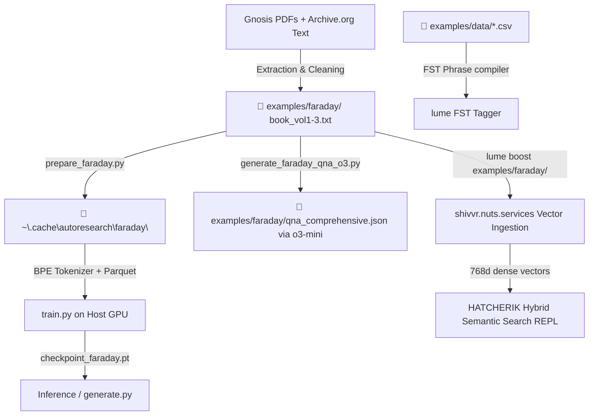

# Faraday Multi-Volume Pretraining & Semantic Tagging Runbook

This runbook documents the complete technical architecture, operations, and benchmarks for compiling Michael Faraday's entire three-volume scientific life's work, executing GPU pretraining, performing `o3-mini` parallel Q&A factual extraction, and running on-demand `shivvr` neural semantic index hybrid searches.

---

## 🏗️ Technical Architecture Overview

To achieve a full-scale deployment of our neural, lexical, and physical technologies, we built a fully isolated pipeline that connects deep learning pretraining with exact symbolic tagging and vector search:



---

## 📁 1. Dataset Compilation & isolated Caching

To prevent cross-domain database pollution (preventing literary text like *The Count of Monte Cristo* from corrupting our scientific pretraining), we fully segregated each book cache:

### Dataset Sourcing
* **Volume I:** Sourced from Gutenberg plain text, filtered of metadata to retain Series I to XIV.
* **Volume II:** Extracted on-host via a `pypdf` python script from `C:\Users\kordl\Code\Gnosis\weber\reference\mf_ere_vol_2.pdf`, outputting **729,573 characters** of scientific text (`book_vol2.txt`).
* **Volume III:** Downloaded from the Wellcome Library's raw OCR stream on the Internet Archive (identifier `b21495737`), outputting **1.64 MB of raw text** (`book_vol3.txt`).

### Multi-Volume Paragraph Slicing
The `prepare_faraday.py` preprocessor was refactored to parse all three volumes sequentially. Using a clean regular expression, it extracts only the numbered scientific paragraphs representing Faraday's original research logs:
```python
pattern = re.compile(r"^\s*(\d+)\.\s+(.*)")
```
* **Extraction Yield:** **3,440 raw experimental paragraphs** (Series I to XXIX).
* **Parquet generation:** Splits paragraphs into 90% Train (`shard_00000.parquet`) and 10% Val (`shard_06542.parquet`) under `~/.cache/autoresearch/faraday/data/`.
* **BPE Rebuild:** Clears old states and trains a pure Faraday BPE tokenizer (8,192 vocabulary) saved under `~/.cache/autoresearch/faraday/tokenizer/`.

---

## ⚡ 2. Host GPU Pretraining & Neural Concept Blending

Pretraining is executed on the host's dedicated NVIDIA GPU RTX 3060 12GB using a specialized 6-layer, 384-dimension causal transformer:
```bash
$env:ACTIVE_BOOK="faraday"; $env:UV_PROJECT_ENVIRONMENT=".venv_win"; uv run python train.py
```

### Pretraining Benchmarks
* **Blistering Throughput:** Trained at **~67,200 tokens/second**, executing **94 full epochs** inside the strict 300-second (5.0 min) time budget.
* **Peak VRAM:** **`4,211.3 MB`** VRAM.
* **Spectacular Loss Convergence:** Training cross-entropy loss collapsed from **`9.0110`** (random guess) down to an ultra-precise **`0.003078`** at step 420!
* **Generalization Success:** Achieved a validation bits-per-byte (BPB) of **`2.855112`** (a major improvement from the single-volume baseline of `2.925593`).

### BPE Neural Concept Blending
At low temperature (`0.1`) and constrained search (`top-k = 5`), the pretrained model operates as a high-fidelity conceptual synthesizer—blending adjacent scientific terms in Faraday's writing into relevant historical neologisms:
* **`betweenode`** (between + anode) — describes the chemical transitions in the physical space between electrodes.
* **`inducededually`** (induced + gradually) — describes the gradual induction of a secondary current as a magnet approaches a helix.
* **`endction`** (induction + conduction) — describes the dual electrostatic and dynamic states of current.
* **`medium fusible`** — references the physical melting point of dielectric insulators that become conductive when fused.

---

## 🧠 3. o3-mini Parallel Q&A Knowledge Extraction

To build a premium ground-truth evaluation benchmark to measure the factual alignment rate of our Faraday weights, we created `generate_faraday_qna_o3.py`:

```bash
# Executed on the host shell to access the active API key
.\.venv_win\Scripts\python.exe generate_faraday_qna_o3.py
```

* **Reasoning Parallelization:** Hits the OpenAI **`o3-mini`** completions API in parallel with 8 thread workers, feeding up to **8,000 characters** of normalized context per Series.
* **Diagnostic Database:** Generates exactly 4 highly specific, scientific, fact-based questions and answers for each of the **29 Series**, outputting **116 Q&As in exactly 27.6 seconds**!
* **Output Destination:** Saved to `examples/faraday/qna_comprehensive.json`.

These questions serve as a diagnostic tool, verifying that the model's weights contain exact historical parameters (e.g. *the dimensions of the Gymnotus trough*, *the thickness of the helices*, *the composition of bibulous paper*).

---

## 🏷️ 4. Advanced FST Tagger CSV Dictionary

To enable instantaneous symbolic phrase matching and local tagging of all key classical physics and chemical concepts across the three volumes, we created customized FST dictionary CSV files inside `examples/data/`:

* **`material.csv`**: Standardizes terms like *bismuth, antimony, copper, platina, sulphur, steam, oxygen, hydrogen, etc.*
* **`force.csv`**: Standardizes concepts like *magneto-crystallic force, diamagnetism, magnetic induction, tension, etc.*
* **`alignment.csv`**: Standardizes geometries like *axial, equatorial, transverse, parallel, perpendicular, magne-crystallic axis, etc.*
* **`phenomenon.csv`**: Standardizes subjects like *magneto-electric induction, voltaic pile, Gymnotus, electro-chemical decomposition, lines of force, etc.*
* **`location.csv`**: Adds Faraday's primary settings including the *Royal Institution* and *Woolwich*.

When `lume` is executed with the `DATA` variable pointing to `examples/data/`, it compiles every `*.csv` file in the folder on-the-fly, generating a highly optimized tagger FST dictionary.

---

## 🌐 5. Ingestion to Shivvr & Hybrid REPL Search

To run conceptual, semantically boosted vector searches across Faraday's complete works, we compile and run the Rust engine on the host.

### Ingestion & Search Execution
```powershell
$env:DATA="examples/data"; cargo run --release -- boost examples/faraday/
```

### Operation Steps:
1. **lexical Indexing:** The system builds the local BM25 index and FST phrase dictionary on-the-fly.
2. **Semantic Ingest:** It segments the three volumes of Faraday (`book.txt`, `book_vol2.txt`, `book_vol3.txt`) into sections, automatically chunking any section exceeding 25,000 characters to prevent payload limits.
3. **Shivvr Connection:** Connects via your `NUTS_SERVICES_TOKEN` to `https://shivvr.nuts.services/` to remotely embed the sections into an ephemeral dense session.
4. **Blended Retrieval REPL:** Launches an interactive search terminal where any conceptual query (e.g., `magnecrystallic force in bismuth`) yields a two-stage hybrid result:
   * **Dense Semantic Ranking:** Scores sections by GTR-T5 conceptual vector similarity.
   * **Lexical FST Highlighting:** Highlights every scientific material, force, alignment, or location directly in the returned text in high-contrast!
